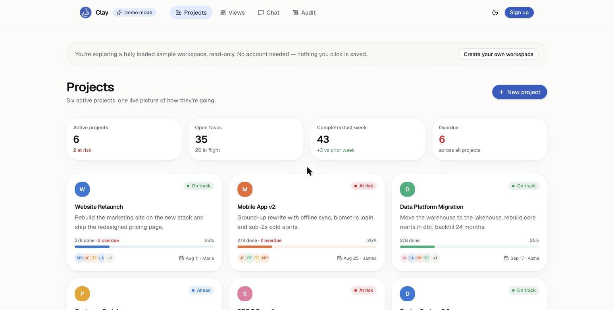
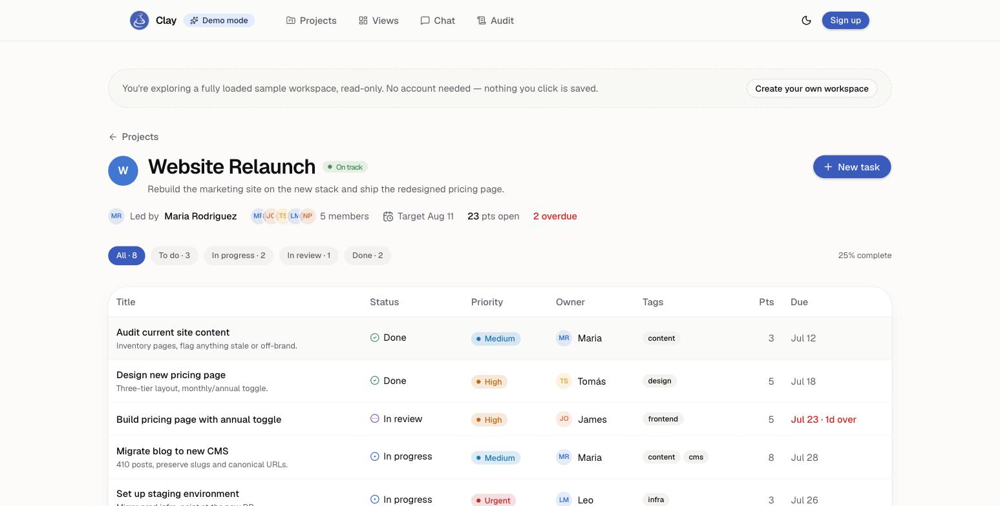
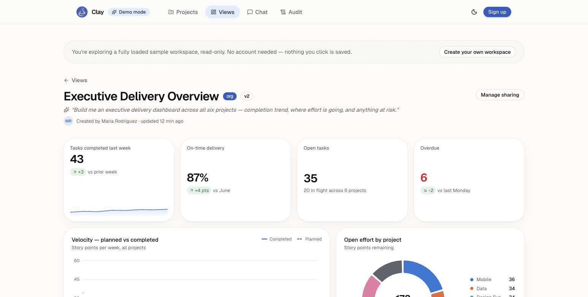
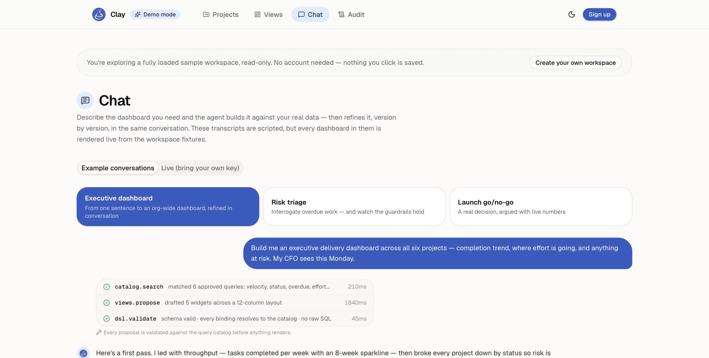
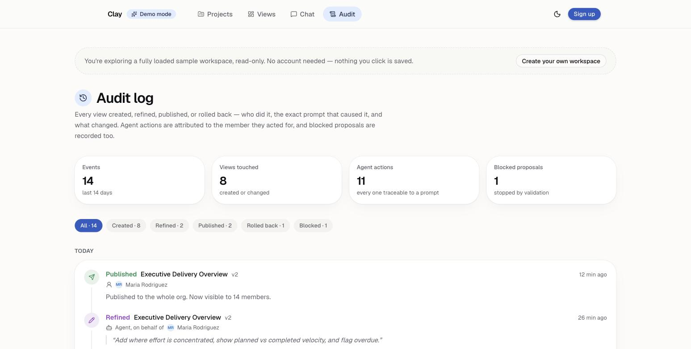

# Clay

       

A project tracker where the UI isn't fixed. Describe the dashboard you need in plain language, and an agent built on the Claude API writes it — live, against your real projects and tasks, in seconds.

Instead of a fixed set of dashboards and a settings menu to configure them, Clay exposes an allow-listed catalog of queries over your data and gives an LLM tool-use loop exactly two abilities: run one of those queries, or propose a view (a small layout of widgets bound to the results). Every request that changes an existing view creates a new version rather than overwriting it, so nothing you or the agent builds is ever lost.

**Live Demo:** [clay-gray.vercel.app](https://clay-gray.vercel.app) — a read-only preview with sample data, no account required. 

**Run Locally:** Open `/demo` (see [Getting Started](#getting-started)).

---


---

## Table of Contents

- [Screenshots](#screenshots)
- [Highlights](#highlights)
- [Tech Stack](#tech-stack)
- [Getting Started](#getting-started)
- [Project Structure](#project-structure)
- [How the Agent Works](#how-the-agent-works)
- [Security Model](#security-model)
- [Contributing](#contributing)
- [Contact](#contact)

---

## Screenshots

| | |
|---|---|
**Project portfolio** — status, load, and overdue work across every project at a glance



**Task board** — status, priority, owner, and points for a single project



**Agent-generated dashboard** — built from one sentence, bound to live catalog queries



**Chat** — the agent's tool calls shown live as it builds a view



**Audit log** — every view created, refined, or published, attributed to the person or agent action behind it



---

## Highlights

- **Ask for a view, get a view** — type a request like "build a delivery dashboard with velocity and overdue work" and the agent inspects the data model, runs a query to sanity-check the shape of the data, and proposes a fully-formed view in one pass. Responses stream token-by-token, tool definitions and the system prompt are prompt-cached across rounds, and you pick which Claude model runs (Sonnet, Opus, or Haiku — it's your key).
- **Ask a question, get an answer** — "which project is most behind?" doesn't force a dashboard on you: the agent runs the same catalog queries and answers in text, citing the real numbers.
- **Drag it yourself** — every view has an edit-layout mode: drag widgets around the same 12-column grid the agent uses, resize from the corner, and save. A manual arrangement is a normal new version, sitting in the same history as agent edits — and fully revertable.
- **Real version diffs** — the history panel shows a structural diff for every version ("+ donut chart", "± bar chart: resized 8×3 → 12×3"), computed from the schemas themselves, with one-click revert.
- **Views that act, not just report** — a fixed, org-scoped *mutation catalog* (create task, update status, assign, set due date) mirrors the query catalog on the write side. Tables can opt into status dropdowns per row; the agent may configure them but can never execute one — writes only happen when a signed-in user clicks.
- **Share a view with anyone** — mint an unguessable, revocable public link that renders a read-only snapshot of the view server-side. No account needed to look; no way to query anything beyond what was shared.
- **Templates** — save any view as a reusable template and stamp out the same dashboard again in one click.
- **A real widget vocabulary** — KPI tiles (with notes and danger intent), multi-series line/area charts, stacked bars, donuts, progress meters, filter bars, and badge-aware tables — all declarative, Zod-validated, and bound to catalog queries; never generated code.
- **Exports that go through the catalog** — any view downloads as a multi-sheet Excel workbook (one sheet per distinct query, plus a cover sheet recording the prompt, version, and filters behind the numbers), any table as CSV, and the whole dashboard as a one-click PDF rendered by headless Chrome against the app's own print stylesheet — charts stay vector-sharp, not rasterized. Exports re-run the same org-scoped catalog queries server-side rather than dumping what the client happens to hold, so they get complete data instead of the widget's 50-row page. The demo exports for real too — same planner, same writers, against the sample fixtures.
- **Versioned, never overwritten** — every agent edit (and every manual one) writes a new `view_versions` row with a parent pointer, so a view's entire prompt/edit history is always recoverable.
- **Read-only, allow-listed agent tools** — the agent never writes SQL or touches the database directly. Its only read path is a fixed catalog of org-scoped queries (`tasksList`, `statusByProject`, `velocityByWeek`, `cycleTimeByWeek`, `createdVsCompleted`, `agingWip`, `pointsByProject`, `overdueTasks`, `upcomingTasks`, `completionsOverTime`, etc.), and every tool call is validated against a Zod schema before it runs.
- **Bring-your-own-key** — the chat UI takes your own Anthropic API key, held only in the browser tab and sent per-request; there's no server-side key to leak or bill against.
- **Full audit trail** — every view created or changed in an organization shows up in the audit log, whether it was the agent or a person.
- **Adversarial test coverage** — a dedicated security suite asserts the agent can never escalate a view to org-wide scope, can't reference an unknown widget type or catalog id, and can't write across an organization boundary even with a version id from the wrong org.
- **Rate-limited by design** — 10 agent requests per 5-minute window per user, enforced server-side ahead of any Anthropic call, with the window state in Postgres so it holds across serverless instances and deploys.
- **Real projects and tasks underneath** — a standard project/task tracker (status, priority, due dates, assignees, comments) sits under the generated-view layer, so there's always real data for views to bind to.

---

## Tech Stack

| Layer | Technologies |
|---|---|
| **Frontend** | Next.js 16 (App Router, Turbopack), React 19, TypeScript (strict), Tailwind CSS v4, shadcn/ui + Radix primitives, React Hook Form + Zod, Recharts |
| **Backend** | tRPC 11, Drizzle ORM, PostgreSQL, Next.js Route Handlers |
| **Auth** | Clerk (organizations provisioned automatically on first sign-in) |
| **AI** | Anthropic Claude via `@anthropic-ai/sdk`, a bounded tool-use loop (max 6 rounds) over a fixed tool set |
| **Exports** | `write-excel-file` for XLSX, hand-rolled RFC 4180 CSV, headless Chrome (`puppeteer-core` + `@sparticuz/chromium`) for PDF |
| **Quality** | Vitest (unit + adversarial security tests), ESLint 9 + typescript-eslint |

---

## Getting Started

**Prerequisites:** Node.js 20+, npm, Docker (for local Postgres), and a Clerk application (publishable + secret key).

```bash
# 1. Clone and install
git clone https://github.com/mariarodr1136/Clay.git
cd Clay
npm install

# 2. Start Postgres
docker compose up -d

# 3. Configure environment
cp .env.example .env.local
# then add your Clerk keys to .env.local:
#   NEXT_PUBLIC_CLERK_PUBLISHABLE_KEY=
#   CLERK_SECRET_KEY=

# 4. Sync the schema to your database
npm run db:push

# 5. Run the app
npm run dev
```

The app runs at http://localhost:3000. Sign up to get an empty personal workspace with a guided start — create your first project, or load a sample workspace (a seeded project plus generated views) with one click. Or visit `/demo` for a read-only, fully loaded showcase with no account: a six-project portfolio, eight example dashboards, scripted agent conversations, and an audit trail. Exports work there for real — open any demo view and download the workbook, a CSV, or the PDF.

To use the "ask your interface into existence" chat, paste your own Anthropic API key into the chat panel — it's sent per-request and never stored server-side.

### Deployment

The live demo runs on [Vercel](https://vercel.com), with Postgres on [Neon](https://neon.tech) and a dedicated Clerk instance for public sign-ups. To deploy your own copy: import the repo into Vercel, add a Postgres database (the Neon integration under the project's Storage tab wires up `DATABASE_URL` automatically), and set `NEXT_PUBLIC_CLERK_PUBLISHABLE_KEY` and `CLERK_SECRET_KEY`. **Schema changes apply themselves on deploy**: `vercel.json` sets the build command to `npm run db:migrate && npm run build`, and the migration files in `drizzle/` are idempotent — safe on a brand-new database, a database that already has the schema, or one that was previously managed with `db:push`.

One caveat about `vercel env pull`: environment variables marked *sensitive* on Vercel are pulled as the literal string `"[SENSITIVE]"`. The resulting `.env.production.local` outranks `.env.local` for local production builds and will break them with "Publishable key not valid" — if you pull env vars and local `next build`/`next start` starts failing, delete that file (`npm run test:e2e` guards itself against this by lifting `.env.local` into the environment).

Two notes on PDF export specifically:

- `PDF_SIGNING_SECRET` is optional — it falls back to `CLERK_SECRET_KEY`, so there's nothing extra to configure.
- The PDF renderer loads one of the app's own pages, which means it makes a request back to its own deployment. If Vercel **Deployment Protection** is enabled for an environment (it is by default on preview deployments), that request is blocked and PDF export fails there with a `502` explaining why. XLSX and CSV are unaffected. `@sparticuz/chromium` also adds roughly 50 MB to the function, so the first PDF after an idle period is slower than subsequent ones.

### Development Workflow

| Command | What it does |
|---|---|
| `npm run dev` | Runs the Next.js dev server (Turbopack) |
| `npm test` | Vitest suite — unit tests plus adversarial agent-security tests |
| `npm run test:e2e` | Builds, then drives the real `/demo` in headless Chrome (pages, layout editor, exports) |
| `npm run lint` | ESLint across the project |
| `npm run build` | Production build |
| `npm run db:push` | Push the Drizzle schema straight to Postgres (dev convenience) |
| `npm run db:generate` / `db:migrate` | Generate versioned SQL migrations from the schema / apply them |
| `npm run db:studio` | Open Drizzle Studio to browse the database |

---

## Project Structure

```
Clay/
├── docker-compose.yml               # Local Postgres for development
├── drizzle.config.ts                # Drizzle Kit config (schema → Postgres via db:push)
├── src/
│   ├── app/
│   │   ├── page.tsx                  # Marketing homepage
│   │   ├── demo/                     # Public, read-only showcase — sample portfolio, dashboards, scripted agent chats
│   │   ├── sign-in/ sign-up/         # Clerk auth pages
│   │   ├── (app)/                    # Authenticated app shell
│   │   │   ├── dashboard/            # Project list
│   │   │   ├── projects/[id]/        # Task board for a single project
│   │   │   ├── chat/                 # "Ask for a view" chat (BYOK Anthropic key + model picker)
│   │   │   ├── views/[viewId]/       # A generated view: layout editor, version diffs, share, templates
│   │   │   └── audit/                # Org-wide activity log
│   │   ├── share/[token]/            # Public, read-only shared views (token-authorized)
│   │   ├── print/                    # Chrome-less print pages the PDF renderer captures (token-gated for live views)
│   │   └── api/
│   │       ├── agent/route.ts        # Runs the Claude tool-use loop for a request
│   │       ├── views/[viewId]/export/    # XLSX / CSV / PDF for a live view
│   │       ├── demo/views/[viewId]/export/  # The same, over the demo fixtures
│   │       └── trpc/[trpc]/          # tRPC route handler
│   ├── components/                   # UI primitives (shadcn/Radix), shared chart core, agent + view components
│   ├── fixtures/                     # Static demo data + sample-workspace view fixtures
│   ├── lib/                          # tRPC client, view DSL (Zod), filter/query-key helpers, task display metadata
│   └── server/
│       ├── agent/                    # Streaming tool-use loop, tool executor, rate limiter, tools/
│       ├── auth/                     # ensureUserOrg — provisions an empty org on first sign-in
│       ├── data-access/              # The query catalog (agent's only read path) + mutation catalog (the only write path)
│       ├── db/                       # Drizzle schema, client, opt-in sample-workspace seed
│       ├── export/                   # Dataset planner, CSV/XLSX writers, PDF renderer, print tokens
│       └── trpc/                     # Routers: projects, tasks, views
└── src/test/                         # Vitest setup helpers
```

---

## How the Agent Works

Every request to `/api/agent` runs a bounded tool-use loop (up to 6 rounds) against Claude — streaming text token-by-token, with prompt-cache breakpoints on the system prompt and tool definitions so multi-round loops don't re-pay for them — with exactly five tools available:

| Tool | Purpose |
|---|---|
| `describe_entities` | Describe the data model (projects, tasks) available to build views over |
| `list_query_catalog` | List the allow-listed, org-scoped queries widgets can bind to |
| `run_query` | Run one catalog query and inspect the real result before proposing a view |
| `get_view` | Fetch an existing view's current schema, e.g. to refine it on a follow-up |
| `propose_view` | Create or patch a view — how the agent builds or changes a view, called at most once as its final action |

A request either targets a project (building a new view) or an existing view (refining one via a follow-up like "make this chart bigger"). Refinements always produce a new `view_versions` row with a `parentVersionId`, never an in-place edit — so the full history of prompts and schemas behind any view is recoverable at any time. Questions about the data ("who has the most overdue work?") are the third kind of request: the agent runs catalog queries and answers in text without creating anything.

There is deliberately **no mutation tool**. The mutation catalog (`src/server/data-access/mutations.ts`) exists for widgets — a task form, a status dropdown on a table row — and those only fire when a signed-in user clicks, under that user's session. The security suite asserts the agent's tool set cannot reach it.

---

## Security Model

- **Every query is org-scoped server-side.** `organizationId` always comes from the authenticated session — no caller, including the agent, ever supplies it as a parameter.
- **The agent's only data access is the query catalog** — a fixed, allow-listed set of read queries (`src/server/data-access/catalog.ts`). It cannot write SQL, and it cannot read or write anything outside that catalog.
- **Every tool call is Zod-validated before it runs.** An invalid `tool_use` block comes back to the model as a normal error result rather than crashing the request, so the model can see what was wrong and retry.
- **Widget types and catalog ids are allow-listed at persistence time**, independent of what the model returns.
- **The agent can never escalate a view to organization-wide scope**, on create or on patch — that requires an explicit user action.
- **Cross-organization writes are rejected**, even when a caller presents a real version id that belongs to a different organization.
- **Writes have their own allow-listed catalog.** Every mutation (create task, update status, assign, set due date) goes through `src/server/data-access/mutations.ts` — org-scoped from the session, Zod-validated, activity-logged. A task can't be attached to another org's project, and an assignee outside the workspace is rejected, even with a real user id.
- **The agent cannot write.** It can propose widgets *bound* to mutations, but its tool set contains no mutation tool — a widget it configured still executes only under the clicking user's authority.
- **Share links are capability tokens.** A shared view renders server-side under the owning org's scope from an unguessable 192-bit token; revoking nulls the token and kills the link instantly. Filter bars and forms are stripped from shared renders — nothing on a public page can query or write.
- **Per-user rate limiting** (10 requests / 5 minutes) sits in front of every Anthropic call, backed by Postgres so limits survive redeploys and apply across instances.
- **Exports use the same choke point as the UI.** A download re-runs the view's bindings through the query catalog server-side rather than serializing rows the client holds, so there's one authorization path rather than two — and CSV values that a spreadsheet would evaluate as formulas are neutralized on the way out.
- **PDF rendering doesn't weaken auth.** The headless browser has no session; the export route — which has already authenticated the caller — signs a 60-second HMAC token naming one view, one organization, and one filter set. The print page authorizes on that alone and scopes every query to the organization inside it, so a missing, tampered, expired, or wrong-secret token renders nothing.

These invariants are covered by a dedicated adversarial test suite (`src/server/agent/security.test.ts`) in addition to the unit tests.

---

## Contributing

Issues and pull requests are welcome.

1. Fork the repository and create a branch (`feat/your-feature` or `fix/your-bug-fix`)
2. Make your changes and run the checks: `npm run lint && npm test && npm run build`
3. Push your branch and open a pull request describing your changes and testing performed

---

## Contact

Questions or feedback? Reach out at [mrodr.contact@gmail.com](mailto:mrodr.contact@gmail.com).
